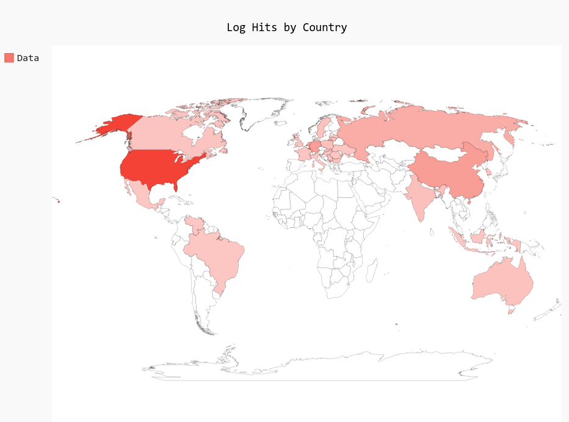

# pyAuthLogVis  
## Description:  
After poking through a few of the internet facing services I host and finding a bunch of failed authentication attempts, I wanted a quick method of visualizing where these authentication attempts were originating from.

This tool uses Ipinfo.io service for IP lookup and PyGaml for data visualization.  


## Requirements:
You will need an Ipinfo.io account to generate an access token. The free tier allows up to 50,000 API calls / month, which should be more than enough.

Python3 is required, and the libraries required are listed in the **requirements.txt**.

The libraries can be easily installed with:  
```pip install -r requirements.txt```  

You will also need to update the **resources/config.yml**.  

